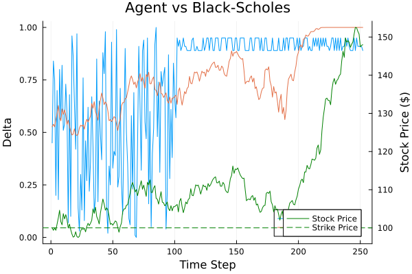

## The Problem: The Options Market Maker

**What is their goal and how do they solve it?**

- **The Role:** Provide liquidity by making markets in options. Without them, the market would fail to provide a mechanism to transfer risk.
- **The Challenge:** Holding an options position exposes the market maker to directional price risk.
- **The Solution:** They must choose a hedge ratio (delta) in the underlying asset to minimize their risk (variance of payoffs) and maximize utility.
- **The Reality:** They must do this under uncertainty, without perfect knowledge of the market's true parameters.

---

## The Gap We're Filling

**Moving beyond perfect theoretical models.**

- We model a **high-fidelity Bayesian agent** who uses a Monte Carlo "mental model" to evaluate the expected utility of a hedge ratio.
- The agent explores the space of possible hedges through **Thompson Sampling**.
- **The Goal:** Model a market maker's actual decision-making process under bounded rationality and observe what behaviors and equilibria emerge organically.

---

## A Game Against Nature

**Connecting Statistical Decisions to Game Theory**

- **Wald (1950) / Giocoli (2013):** A statistical decision problem is effectively a 2-person game against Nature.
- **The Setup:** The agent is a Bayesian decision-maker facing a statistical decision problem. They choose an action to maximize utility against Nature's stochastic process (Geometric Brownian Motion).
- **Constructive Rationality:** Following **Tesfatsion (2017)**, economic systems are locally constructive sequential games. Actions are based on local states, and equilibrium *emerges* rather than being analytically pre-determined.
- **Buchanan (2001):** Focus on the rules governing interactions and the emergent properties of interdependent choices.

---

## Literature Context

**Bandits, Hedging, & Imperfect Markets**

- **RL & Bandits in Finance:**
  - *Huo & Fu (2017)*, *Zhu et al. (2019)*: Multi-armed bandits and Thompson Sampling for portfolio selection.
  - *Cannelli et al. (2023)*, *Vittori (2021)*: RL and bandits for dynamic hedging and portfolio construction.
- **Gaps in Theory vs. Reality:**
  - *Figlewski (1989):* Explores arbitrage in imperfect markets. The gap between theoretical models and reality causes market makers to adopt different, adaptive strategies.
  - *Brock et al. (1992)* & *Geweke & Amisano (2011)*: Modeling predictive distributions and technical rules in complex, noisy returns.

---

## The Agent's Mind: Mental Simulation

**How does the agent evaluate a hedge?**

- The agent does **not** know the Black-Scholes formula.
- Instead, it uses a **Mental Simulation**:
  - Simulates multiple price paths into the future based on its *current beliefs* about market drift and volatility.
  - Calculates the expected payoff and variance of holding a specific delta over those simulated paths.
  - Evaluates the utility: `Utility = -Variance(Payoffs)` (acting as a risk-averse hedger).

---

## Exploration via Thompson Sampling

**Learning through trial and error.**

- The agent balances exploring new deltas and exploiting known good deltas using **Thompson Sampling**.
- Maintains a Normal-Inverse Gamma conjugate prior for the expected utility of each discrete delta choice.
- **Market Beliefs:** Updates its belief about market direction transitioning from a Beta Prior to a Posterior based on observed up/down moves:
  $$ \alpha_{t+1} = \alpha_t + \mathbb{1}_{\{S_{t+1} > S_t\}} $$
  $$ \beta_{t+1} = \beta_t + \mathbb{1}_{\{S_{t+1} \leq S_t\}} $$

---

## The "Black-Scholes" Tension

**Theory vs. Bounded Reality**

- **Black-Scholes (The Theory):**
  - Assumes continuous, costless trading and perfect knowledge of volatility.
  - Calculates a precise, dynamic *True BS Delta*.
- **Bandit Agent (Our Simulation):**
  - Operates with finite computing power and a discrete choice set ($\Delta \in \{0.0, 0.01, \dots, 1.0\}$).
  - Learns variance and drift on the fly.
  - **The Discovery:** A perfect "Risk-Neutral" hedge may be impossible for a bounded agent. The divergence is a feature of bounded reality, not a bug.

---

## Results & Emergent Behaviors

**The Cost of Learning**

{width=80%}

- The agent minimizes `-var_payoff` to hedge, but its path relies on sampled beliefs. The distance from the *True BS Delta* quantifies the cost of learning under uncertainty.

---

## Live Simulation Metrics

```{julia}
#| echo: false
#| output: true
#| warning: false
# Catch stdout to display the simulation summary
using Suppressor
output = @capture_out begin
    include("omm-sim.jl")
end

# Extract and display the summary lines
lines = split(output, "\n")
summary_start = findfirst(contains.("--- Simulation End Report ---"), lines)
if summary_start !== nothing
    for line in lines[summary_start:end]
        println(line)
    end
else
    println("Simulation ran successfully.")
end
```

---

## Future Directions: The Horizon

**Where do we go from here?**

- **Continuous Choice Space:** Move from discrete delta buckets to a continuous action space.
- **Nested Simulations:** Upgrade the mental sim to optimize for a *dynamic* hedge recursively, rather than simulating the expected value from holding a static hedge until expiration.
- **Agent-Based Computational Economics (ACE):** Introduce an interacting ecology of learning agents. Will a Walrasian-like equilibrium emerge from the bottom up?
